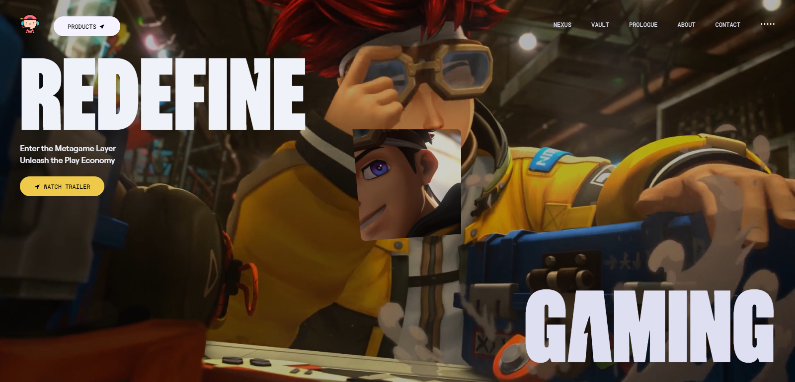

# FiverrServices

## 📋 <a name="table">Table of Contents</a>

1. 🔗 [LiveDemo](#livedemo)
2. ⚙️ [Tech Stack](#tech-stack)
3. 🔋 [Features](#features)
4. 🔗 [Assets](#links)

## <a name='livedemo'>[🔗LiveDemo]() </a>

## <a name="tech-stack">⚙️ Tech Stack</a>
- GSAP
- React.js
- Tailwind CSS

## <a name="features">🔋 Features</a>

**Scroll-Based Animations**: Dynamic animations triggered by scrolling for a more engaging user experience.

**Clip Path Shaped Animations**: Unique geometric transitions using CSS clip-paths to create visually stunning effects.

**3D Hover Effects**: Interactive 3D transformations that respond to user interactions for a modern feel.

**Video Transitions**: Seamlessly integrated video elements to enhance storytelling and flow.

**Smooth UI/UX**: Polished interfaces with buttery-smooth interactions for an intuitive user journey.

**Completely Responsive**: Flawless adaptation across all devices, ensuring a consistent experience.
   
## <a name="links">🔗 Assets</a>

Assets used in the project can be found [here](https://drive.google.com/file/d/12hCVnanOAUmM1vzz2dTWZ_uEFGG8xDcT/view?usp=sharing)

> This project uses some assets and fonts from **[Zentry](https://zentry.com/)** purely for educational and demonstration purposes. All rights to these assets and fonts belong to their respective owners. 